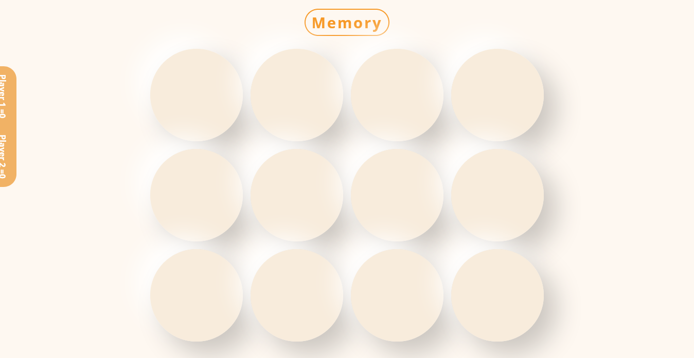

# from 0 - Memory game

I started this proyect from 0 without any kind of template nor trying to copy one, wich would ad been kind of useful but i got an indea in my head and im kind of happy to be able to put it on the code
just like it was in my head

## Table of contents

- [Overview](#overview)
  - [The challenge](#the-challenge)
  - [Screenshot](#screenshot)
  - [Links](#links)
- [My process](#my-process)
  - [Built with](#built-with)
  - [What I learned](#what-i-learned)
  - [Continued development](#continued-development)
  - [Useful resources](#useful-resources)
- [Author](#author)
- [Acknowledgments](#acknowledgments)

**Note: Delete this note and update the table of contents based on what sections you keep.**

## Overview


### Screenshot




### Links

- Live Site URL: [Add live site URL here](https://silkiercomet.github.io/memory-game/)

## My process


### Built with

- Semantic HTML5 markup
- CSS custom properties
- Flexbox
- CSS Grid
- JavaScript
- OOP


### What I learned

Use this section to recap over some of your major learnings while working through this project. Writing these out and providing code samples of areas you want to highlight is a great way to reinforce your own knowledge.

To see how you can add code snippets, see below:

```html
<h1>Some HTML code I'm proud of</h1>
```
```css
.proud-of-this-css {
  color: papayawhip;
}
```
```js
const proudOfThisFunc = () => {
  console.log('🎉')
}
```


### Continued development

Use this section to outline areas that you want to continue focusing on in future projects. These could be concepts you're still not completely comfortable with or techniques you found useful that you want to refine and perfect.

### Useful resources

- [resource 1](https://www.dottedsquirrel.com/hover-flip-card/) - This helped me to implement the flip to the cards


## Author

- Github - [Luis Colina](https://github.com/Silkiercomet)
- Frontend Mentor - [@Comet466](https://www.frontendmentor.io/profile/Comet466)
- Twitter - [@yourusername](https://www.twitter.com/LuisHill9)


## Acknowledgments

This is where you can give a hat tip to anyone who helped you out on this project. Perhaps you worked in a team or got some inspiration from someone else's solution. This is the perfect place to give them some credit.

**Note: Delete this note and edit this section's content as necessary. If you completed this challenge by yourself, feel free to delete this section entirely.**
